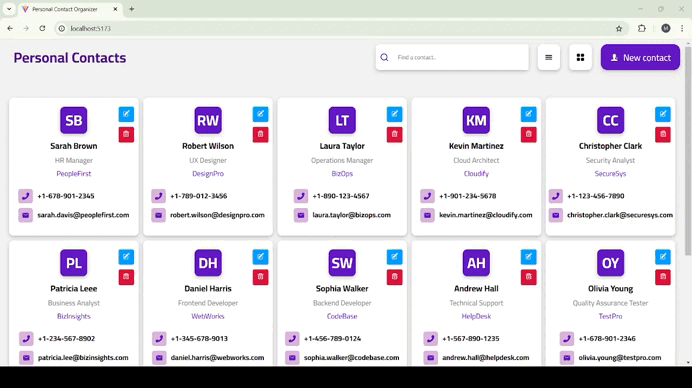

# Personal Contact Manager
This project is my first react project. With this project I used many libraries as a first time and  I have stepped into the world of react. 
# Project Features
📌 Contact Management: Add, update, delete, and search contacts.
🔎 Search Functionality: Easily search through contacts.
💻 React + Vite: Used Vite for a fast development environment.
📡 Axios API Integration: Made API calls to JSON Server to fetch data.
🎨 Dynamic UI: Designed modern UI with cards and modals.
# With this project, I learned that
✔️ React’s key concepts such as components, state, and props.
✔️ Integrating CRUD operations with a dynamic interface.
✔️Error handling and improving the user experience with API calls.
✔️Setting up a fast development environment with Vite.
# Preview of the Project

